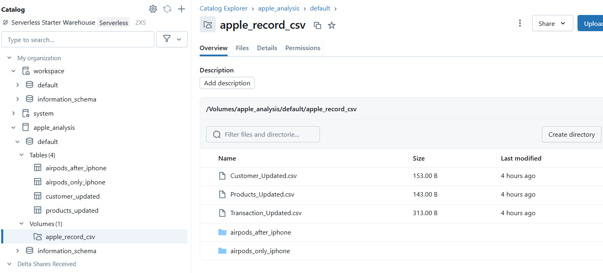

###  Apple-Data-Analysis

#### Apple Dataset ETL Pipeline with Databricks

#### 📌 Project Overview

- This project demonstrates how to build end-to-end ETL pipelines on Databricks using PySpark (Apache Spark’s Python API).
The goal is to process, transform, and load Apple datasets efficiently while showcasing industry-grade **data engineering design patterns** and **Spark optimization techniques**.

#### ⚙️ Tech Stack

- **Databricks** – Unified analytics platform for building ETL pipelines

- **Apache Spark (PySpark)** – Distributed data processing engine

- **Delta Lake** – For ACID-compliant storage and Lakehouse architecture

- **DataLake & Data Lakehouse** – Storage & serving layers

#### 📂 Data Sources

We ingested data from multiple formats:

- **CSV**

- **Parquet**

- **Delta Table**

A **Factory Pattern** was used to design the **Reader class**, allowing seamless integration of multiple data sources. This design makes the pipeline **scalable, reusable, and maintainable**.

#### 🔄 ETL Pipeline Design

A. Extract

- Data read from CSV, Parquet, and Delta Lake using a Factory Pattern.

B. Transform

- Applied business transformation logic using:

- **PySpark DataFrame API**

- **Spark SQL**

- Implemented advanced Spark concepts:

- **Broadcast Join** for optimizing skewed joins

- **Partitioning & Bucketing** for efficient storage & query performance

- **Window Functions** (e.g., LAG, LEAD) for analytical use cases

- **Delta Table** operations for incremental data handling

C. Load

- **Data loaded** into two destinations:

- **Data Lake** (for raw + transformed storage)

- **Data Lakehouse** (for analytics-ready storage with Delta tables)

#### 🏗️ Concepts Demonstrated

- SparkSession creation & configuration

- **Reader class** using Factory Pattern

- **Business logic** with **Spark DataFrame** API & SQL

- **Broadcast join** optimization

- **Partitioning and bucketing strategies**

- **Window functions** (LAG, LEAD, etc.)

- **Delta Lake** for incremental updates & Lakehouse architecture

#### 🚀 Key Learnings

- How to design **scalable ETL pipelines** on Databricks

- Using **Low-Level Design (LLD)** patterns like Factory Pattern in data engineering

- Difference between **Data Lake vs. Data Lakehouse** architectures

- Optimizing Spark workloads with **joins, partitions, bucketing, and caching**

#### 📊 Future Enhancements

- **Add unit tests** for ETL pipeline validation

- Implement **Airflow** orchestration for scheduling

- Enable CI/CD with **GitHub Actions** for automated deployment

- Integrate with **BI tools** (Power BI / Tableau) for visualization

#### 👉 This project is a hands-on demonstration of data engineering best practices with PySpark & Databricks. It highlights how to design flexible pipelines that scale with multiple sources and destinations while leveraging modern Lakehouse architecture.

